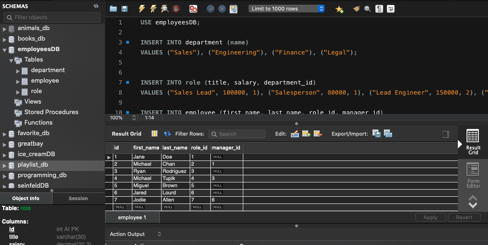

# Employee-Tracker

## About:
Keeping track of information is essential for modern businesses. Whether you are keeping financial records, inventroy records, or even just keeping track of your employees, modern day corporations have grown to the size that needs to store all of this somewhere. Thanks to the integration of databases into modern day coding softwares, its is now easier than ever for a coder to keep virtual track of a companies information.

This application uses the command line interface to interact with 3 databases held in MySql by using JavaScript. Functions are used to add, view, or update the content in the databases to make it dynamically interactive.

## Index
1) [About](#About)
1) [Installation](#Installation)
2) [Usage](#Usage)
3) [Contributors](#Contributors)
4) [GitHub](#GitHub)

## Installation:
All dependencies are held in the package.json file. By entering "npm i" into your command line, they will all be downloaded locally. You must connect MYSQL with a password in order for the database to connect. You can populate the database by copying and pasting (in order) the employeeDBSchema.sql file followed by employeeSeeds.sql into your workbench.

## Usage:
You must run this application natively in your terminal. For additional notes, check the Installation section.

## Contributors:
Andrew Kleiner

## GitHub Username:
akleiner26

## GitHub Repo:
https://github.com/akleiner26

## GitHub Photo:
 

## GitHub Email:
AndrewJKleiner@gmail.com

## Screenshots
### Running the Schema

### Running the Seeds

### Opening the App

### Adding a Department

### Added Department to the Database

### Adding a Role

### Added Role to the Database

### Adding an Employee

### Added Employee to the Database

### View By Department

### View By Role

### View All Employees

### Updating A Role

### Updating Employees Manager

### Updated Role and Manager in the Database

### Ending the Application
